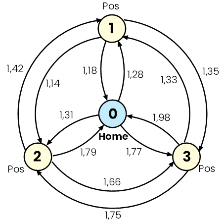
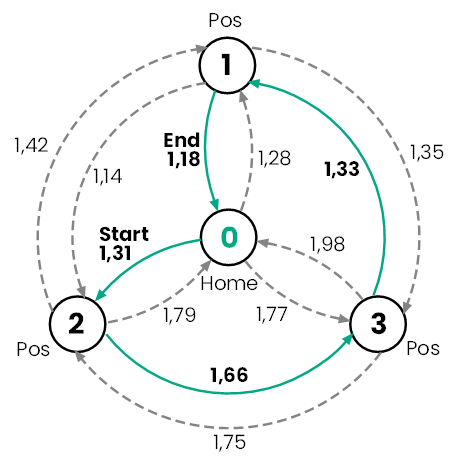

## What do NDT, the Traveling Salesman, and the Universe have in common?

A short journey through the Traveling Salesman Problem to optimize inspection trajectories.

**TL;DR:** below is a small tool designed to reorder inspection positions and minimize overall inspection time.

### Problem Statement

In industrial applications such as X-ray Non-Destructive Testing (NDT) or Printed Circuit Board (PCB) assembly — where robotic manipulation is involved — the efficiency of inspection or pick-and-place tasks critically depends on the sequence of movements between positions. The path taken by a manipulator significantly affects the total operation time. This is not just a mechanical issue — it’s a computational challenge. The problem closely resembles the well-known **Asymmetric Traveling Salesman Problem (ATSP)**, a variation of the classic **[Traveling Salesman Problem (TSP)](https://en.wikipedia.org/wiki/Travelling_salesman_problem)**.

In X-ray NDT, inspection typically involves multiple positions (especially in 2D inspection). Here’s an example from a real-world scenario: an engine block inspection with 66 positions. The X-ray source is located on the right side, and the detector is on the left.


A [publicly available video](https://youtu.be/-fnSnCGQZKk?t=177) shows the inspection process (starting at **2:57**).

For example, let’s take a simpler case: inspecting an engine piston might require just three distinct views (two from sides and one from the top). The typical time to move from one position to another is around **1–2 seconds**, as shown in the video above. However, the time taken to move between these positions may not be symmetric, meaning the time to move from position 1 to 2 is not equal to the time to move back from 2 to 1 due to:

- Direction-dependent axis speeds and mechanical inertia
- X-ray generator ramp-up/ramp-down times when changing kV and mA
- Other delays, such as detector frame timing, filter changes, etc.

Here is a simple diagram for three positions (time in seconds):



Usually, inspection starts from the **“Home”** position (also called the ground or base position) and finishes at the same Home position before the part is ejected from the radiation-protected cabinet. Let’s denote the positions as:

$$
P_0 (Home), P_1, P_2, P_3
$$

where the first one is the Home position, where the inspection begins and ends. The movement time between positions can then be represented as a **cost matrix**:

$$
C = \begin{bmatrix} 0 & c_{01} & c_{02} & c_{03} \\ 
c_{10} & 0 & c_{12} & c_{13} \\ 
c_{20} & c_{21} & 0 & c_{23} \\ 
c_{30} & c_{31} & c_{32} & 0 \\ 
\end{bmatrix}
$$

Where $c_{ij}$ represents the movement time from position $i$ to position $j$. In the general case:

$$
c_{ij} \neq c_{ji}
$$

which introduces **asymmetry**.

The diagram shown above can be represented as the following table (time in seconds):

|  Position  |  P0  |  P1  |  P2  |  P3  |
| ---- | ---- | ---- | ---- | ---- |
|P0|0|1.283 s|1.311 s|1.770 s|
|P1|1.184 s|0|1.137 s|1.352 s|
|P2|1.791 s|1.420 s|0|1.658 s|
|P3|1.976 s|1.326 s|1.747 s| 0       |

This matrix can be created in a simple way: just perform all possible movements (e.g., 1 → 2, 2 → 1, 1 → 3, 3 → 1, and so on) and measure the time from the **“Move to Next Position”** command to **“Start Image Acquisition.”**

Now the question is — what is the most optimal inspection strategy (the fastest route)?

In this example, it’s quite straightforward — we have only **6 possible inspection routes**:

|  Route  |  Time  |  Remark  |
| ---- | ---- | ---- |
|P0 -> P1 -> P2 -> P3 -> P0| 6.054 seconds | Sequential|
|P0 -> P1 -> P3 -> P2 -> P0| 6.173 seconds |Worst case|
|P0 -> P2 -> P1 -> P3 -> P0| 6.059 seconds ||
|P0 -> P2 -> P3 -> P1 -> P0| 5.479 seconds |  ✅ Optimal|
|P0 -> P3 -> P1 -> P2 -> P0| 6.024 seconds ||
|P0 -> P3 -> P2 -> P1 -> P0| 6.121 seconds ||

And the route **Home → P2 → P3 → P1 → Home** is the fastest route (1.31 + 1.66 + 1.33 + 1.18 = **5.48 seconds**):



It sounds simple with only three positions, but what about more — say, **60** (which might be required to inspect a more complex part, like the motor’s cylinder head shown above)? How many possible routes do we have?

The brute-force approach to solving the ATSP involves checking all permutations of paths. For **n** positions, the number of possible paths is:

$$
n! = \text{factorial of } n
$$

For n = 60:

$$
60! \approx 8.32 \times 10^{81}
$$

This **huge** number is comparable to the estimated number of atoms in the observable Universe (about $10^{80}$), making brute-force computation completely infeasible. Just take a look at this amazing [photo from the James Webb Space Telescope](https://www.esa.int/Science_Exploration/Space_Science/Webb/Webb_delivers_deepest_image_of_Universe_yet) — most of the dots you see are not stars; they are entire galaxies:


Back to the Earth: mathematically, we need to minimize the total travel cost using the following objective function:

$$
\min \sum_{i=0}^{n} \sum_{j=0}^{n} c_{ij} \cdot x_{ij}
$$

where $x_{ij}$ are the **decision variables**:

$$
x_{ij} = \begin{cases} 1 & \text{if we travel from } i \text{ to } j  \\ 
0 & \text{otherwise} \end{cases}
$$

**Sidenote 1:** This well-known problem is classified as **NP-hard**, meaning it is at least as hard as the hardest problems in **NP (Nondeterministic Polynomial time)**. Do not confuse this with **NP-complete** (sometimes called NP-full). They are closely related but not identical: NP-complete refers to the *decision version* of TSP (e.g., “Is there an inspection route with total cost ≤ T?”), but our case is the *optimization version* of TSP (finding the shortest inspection route starting and ending at a given position), which is NP-hard.

**Sidenote 2:** Do not confuse this with the well-known **[Dijkstra’s algorithm](https://en.wikipedia.org/wiki/Dijkstra%27s_algorithm)**. Dijkstra’s algorithm finds the shortest path from a source node to all other nodes in a weighted oriented graph. It does not guarantee visiting every node exactly once, so it cannot solve TSP or ATSP.

But how do we solve our movement problem? There are two possible ways — it can be solved using **exact** and **heuristic** approaches.

Exact algorithms guarantee an optimal solution (absolute minimum) but are computationally expensive for large amount of inspection positions. On the other hand, Heuristic Algorithms provide near-optimal solutions much faster, making them suitable for large-scale problems.

The major approaches for exact algorithms are Brute Force, Branch and Bound / Branch and Cut, Dynamic Programming (Held-Karp Algorithm) and Integer Linear Programming (ILP) or Mixed-Integer Linear Programming (MILP).

Among these, **[MILP](https://en.wikipedia.org/wiki/Integer_programming)** is often the most practical because It guarantees optimality if allowed to run to completion and we can stop the solver early to get a near-optimal solution, which is common practice for large-scale optimization. MILP solvers handle NP-hard problems but can take hours or even days to find the exact optimum for very large instances.

### Solution (Rust)

As I’m learning programming in Rust, here’s a possible solution using **[good_lp](https://github.com/rust-or/good_lp)**, a Mixed Integer Linear Programming (MILP) modeler, together with the **[HiGHS](https://highs.dev/)** solver.

If you prefer to start from the scratch, you will need:

```
cargo init
cargo add good_lp csv indicatif
```

Then, slightly modify **Cargo.toml** to enable the `highs` feature:

```toml
[package]
name = "milpr"
version = "0.1.0"
edition = "2024"

[dependencies]
csv = "1.4.0"
good_lp = { version = "1.14.2", features = ["highs"], default-features = false }
indicatif = "0.18.3"
```

The [csv](https://crates.io/crates/csv) and [indicatif](https://crates.io/crates/indicatif) crates are used to load the cost matrix from a CSV file and display progress during computation.

Now, the complete solver code is as follows:

```rust
/// Solve ATSP and return (optimal_time, route)
fn solve_atsp(cost_matrix: Vec<Vec<f64>>) -> (f64, Vec<String>) {
	let n = cost_matrix.len();
	assert!(n > 1, "Matrix must have at least 2 nodes");

	// Compute sequential path cost for reference
	let mut seq_cost = 0.0;
	for i in 0..n - 1 {
		seq_cost += cost_matrix[i][i + 1];
	}
	seq_cost += cost_matrix[n - 1][0]; // return to Home
	println!(
		"Sequential movement (Home > 1 > 2 > ... > Home): {:.3} seconds",
		seq_cost
	);

	for row in &cost_matrix {
		assert_eq!(row.len(), n, "Matrix must be square");
	}

	// Variable creation
	let total_bin = n * (n - 1);
	println!(
		"Creating {} binary variables and {} MTZ variables...",
		total_bin, n
	);
	let mut vars = ProblemVariables::new();

	// Decision variables x[i][j] -> {0,1}, i != j
	let mut x = vec![vec![vars.add(variable().binary()); n]; n];
	for i in 0..n {
		for j in 0..n {
			if i != j {
				x[i][j] = vars.add(variable().binary());
			}
		}
	}

	// MTZ (Miller–Tucker–Zemlin) variables u[i] -> integer
	let mut u = vec![vars.add(variable().integer().min(0)); n];
	for i in 1..n {
		u[i] = vars.add(variable().integer().min(1).max((n - 1) as f64));
	}

	// Objective
	println!("Building objective with {} terms...", total_bin);
	let mut objective = Expression::default();
	for i in 0..n {
		for j in 0..n {
			if i != j {
				objective += cost_matrix[i][j] * x[i][j];
			}
		}
	}
	
    //Problem:
	let mut problem = vars.minimise(objective.clone()).using(default_solver);

	// Degree constraints
	println!("Adding {} degree constraints...", 2 * n);
	for i in 0..n {
		let mut row_out = Expression::default();
		let mut row_in = Expression::default();
		for j in 0..n {
			if i != j {
				row_out += x[i][j];
				row_in += x[j][i];
			}
		}
		problem.add_constraint(row_out.eq(1.0));
		problem.add_constraint(row_in.eq(1.0));
	}

	// MTZ constraints to ensure a single Hamiltonian cycle.
	let mtz_count = (n - 1) * (n - 2);
	println!("Adding {} MTZ constraints...", mtz_count);
	for i in 1..n {
		for j in 1..n {
			if i != j {
				problem.add_constraint(
					u[i] - u[j] + ((n as f64) - 1.0) * x[i][j]
					 	<< (n as f64) - 2.0,  // in Python 1.0 see remark
				);
			}
		}
	}

	// Start from HOME (u[0] = 0)
	problem.add_constraint(Expression::from(u[0]).eq(0.0));

	// Solve
	let sp_solve = spinner("Solving (MILP)...");
	let solution = problem.solve().unwrap();
	sp_solve.finish_with_message("Solved");

	let optimal_time = solution.eval(&objective);

	// Reconstruct route
	let mut route = Vec::new();
	route.push("Home".to_string());
	let mut current = 0usize;

	for _ in 0..n - 1 {
		for j in 0..n {
			if current != j && solution.value(x[current][j]) > 0.5 {
				route.push(j.to_string());
				current = j;
				break;
			}
		}
	}
	route.push("Home".to_string());

	(optimal_time, route)
}
```

The correct form of the MTZ (Miller-Tucker-Zemlin) subtour elimination constraint for your asymmetric Traveling Salesman Problem (TSP) MILP model is:

$$
u_i - u_j + (n - 1) x_{i,j} \leq n - 2 \quad \forall i \neq j, \quad i,j \in \{1, \ldots, n-1\}
$$

where $(u_i)$ are the position variables for the nodes, $(x_{i,j})$ are binary decision variables indicating if the edge from $(i) to (j)$ is in the tour, and $(n)$ is the number of nodes. This constraint ensures no subtours form and a single [Hamiltonian cycle](https://en.wikipedia.org/wiki/Hamiltonian_path) is maintained in the solution.

And this is how it used:

```rust
fn main() -> Result<(), Box<dyn Error>> {
	let args: Vec<String> = env::args().collect();
	if args.len() < 2 {
		eprintln!("Usage: {} <path_to_csv>", args[0]);
		std::process::exit(1);
	}

	let cost_matrix = load_cost_matrix(&args[1])?;
	let (time, path) = solve_atsp(cost_matrix);

	println!("Optimal movement: {:.3} seconds", time);
	println!("Route: {}", path.join(" > "));
	Ok(())
}
```

(Full source code, including the CSV loader, is available in this repository.)

The cost matrix in the CSV file should look like this:

```
0.000;1.283;1.311;1.770
1.184;0.000;1.137;1.352
1.791;1.420;0.000;1.658
1.976;1.326;1.747;0.000
```

(Separators such as **comma**, **semicolon**, and **tab** are supported. For decimal delimiters, both **dot** and **comma** are accepted.)

Then, this tool can be used as simply as:

```
milpr.exe cost_matrix_3.csv
milpr.exe cost_matrix_60.csv
milpr.exe cost_matrix_120.csv
```

Output:

```
Reading CSV ..\..\csv\cost_matrix_60.csv
CSV loaded
Sequential movement (Home > 1 > 2 > ... > Home): 90.716 seconds
Creating 3540 binary variables and 60 MTZ variables...                                   Building objective with 3540 terms...
Adding 120 degree constraints...
Adding 3422 MTZ constraints...
⠏ Solved - 00:00:10
Optimal movement: 61.727 seconds
Route: Home > 23 > 24 > 11 > 17 > 14 > 13 > 32 > 16 > 33 > 59 > 12 > 43 > 52 > 30 > 55 > 36 > 57 > 42 > 47 > 10 > 46 > 21 > 26 > 44 > 34 > 56 > 41 > 31 > 19 > 6 > 58 > 48 > 27 > 49 > 20 > 22 > 53 > 4 > 3 > 9 > 18 > 45 > 38 > 39 > 40 > 29 > 37 > 5 > 8 > 50 > 2 > 51 > 28 > 54 > 7 > 35 > 25 > 15 > 1 > Home
```

### Results

For 3, 60 and 120 positions:

|               | Computation Time | Sequential Movement | Optimized Movement |
| ------------- | ---------------- | ------------------- | ------------------ |
| 3 Positions   | Zero             | 6.054 seconds       | 5.479 seconds      |
| 60 Positions  | 10 seconds       | 90.716 seconds      | 61.727 seconds     |
| 120 Positions | 40 seconds       | 181.027 seconds     | 121.644 seconds    |

As you can see, the movement time with randomly generated values in the range of **1–2 seconds** (average ≈ 1.5 seconds) was optimized to **61.7 seconds for 60 positions** and **121.6 seconds for 120 positions** — using the truly shortest path. Most transitions chosen were those with approximately one second of movement time.

Optimal route for 60 positions:

```
Route: Home > 23 > 24 > 11 > 17 > 14 > 13 > 32 > 16 > 33 > 59 > 12 > 43 > 52 > 30 > 55 > 36 > 57 > 42 > 47 > 10 > 46 > 21 > 26 > 44 > 34 > 56 > 41 > 31 > 19 > 6 > 58 > 48 > 27 > 49 > 20 > 22 > 53 > 4 > 3 > 9 > 18 > 45 > 38 > 39 > 40 > 29 > 37 > 5 > 8 > 50 > 2 > 51 > 28 > 54 > 7 > 35 > 25 > 15 > 1 > Home
```

Computation time increased from 10 seconds for 60 positions to 40 seconds for 120 positions, which is still fully acceptable — less than one minute. Filling the cost matrix is also feasible, because for 60 positions, you need to perform 3600 manipulator movements, taking about 5400 seconds (assuming 1.5 seconds per movement on average), which is roughly 90 minutes. For 120 positions, this measurement could take around 6 hours. It is assumed that the manipulator can reach any position from any other position **collision-free**.

### Python Exercises

The MILP solver implemented in Rust is not the only possible approach. Let’s explore other 10 algorithms in Python (they can certainly be implemented in Rust as well, but Python is much simpler for this domain).

Dependencies:

```
pip install numpy pandas scipy gurobipy
```

#### [Brute Force (Naive)](https://github.com/AndrDm/atsp-ndt/blob/c4778e51a49071971e98f58eb776f2c114d8743d/all_solvers.py#L546)

- **Idea:** Enumerate all possible tours and pick the shortest.
- **Complexity:** $O(n!)$ — grows factorially with number of positions.
- **Pros:** Guarantees optimal solution.
- **Cons:** Completely impractical for anything beyond ~12 positions.

------

#### [Held-Karp Algorithm](https://github.com/AndrDm/atsp-ndt/blob/c4778e51a49071971e98f58eb776f2c114d8743d/all_solvers.py#L565)

- **Idea:** Dynamic programming approach using subsets of positions.
- **Complexity:** $O(n^2 \cdot 2^n)$.
- **Pros:** Exact solution, much faster than brute force.
- **Cons:** Still exponential; feasible only for small $n$ (up to ~25 positions).

------

#### [Greedy (Fastest)](https://github.com/AndrDm/atsp-ndt/blob/c4778e51a49071971e98f58eb776f2c114d8743d/all_solvers.py#L52)

- **Idea:** Start from a city, repeatedly pick the nearest unvisited city.
- **Complexity:** $O(n^2)$.
- **Pros:** Very fast, easy to implement.
- **Cons:** Produces poor-quality solutions for some routes; no guarantee of optimality.

------

#### [Simulated Annealing](https://github.com/AndrDm/atsp-ndt/blob/c4778e51a49071971e98f58eb776f2c114d8743d/all_solvers.py#L83)

- **Idea:** Probabilistic search that accepts worse solutions early to escape local minima, gradually reducing randomness.
- **Complexity:** Depends on iterations; typically polynomial.
- **Pros:** Good for large instances; flexible.
- **Cons:** No guarantee of optimality; tuning parameters is tricky.

------

#### [Ant Colony Optimization](https://github.com/AndrDm/atsp-ndt/blob/c4778e51a49071971e98f58eb776f2c114d8743d/all_solvers.py#L121)

- **Idea:** Mimics ant behavior using pheromone trails to reinforce good paths.
- **Complexity:** Polynomial but depends on iterations and colony size.
- **Pros:** Good heuristic for large problems; adaptive.
- **Cons:** Slower than greedy; requires parameter tuning.

------

#### [Tabu Search](https://github.com/AndrDm/atsp-ndt/blob/c4778e51a49071971e98f58eb776f2c114d8743d/all_solvers.py#L180)

- **Idea:** Local search with memory (tabu list) to avoid revisiting recent solutions.
- **Complexity:** Polynomial; depends on iterations.
- **Pros:** Escapes local minima better than simple local search.
- **Cons:** No guarantee of optimality; parameter tuning needed.

------

#### [Lin-Kernighan (2-Opt and beyond)](https://github.com/AndrDm/atsp-ndt/blob/c4778e51a49071971e98f58eb776f2c114d8743d/all_solvers.py#L229)

- **Idea:** Iteratively improve tour by swapping edges (2-opt, 3-opt, etc.).
- **Complexity:** $O(n^2)$ per iteration.
- **Pros:** Very effective heuristic; widely used in practice.
- **Cons:** Still heuristic; can get stuck in local minima.

------

#### [Genetic Algorithm](https://github.com/AndrDm/atsp-ndt/blob/c4778e51a49071971e98f58eb776f2c114d8743d/all_solvers.py#L261)

- **Idea:** Evolutionary approach using crossover and mutation on tours.
- **Complexity:** Depends on population size and generations.
- **Pros:** Good for large problems; highly parallelizable.
- **Cons:** No guarantee of optimality; parameter tuning required.

------

#### [Mixed Integer Linear Programming (MILP)](https://github.com/AndrDm/atsp-ndt/blob/c4778e51a49071971e98f58eb776f2c114d8743d/all_solvers.py#L388)

- **Idea:** Formulate ATSP as MILP and solve with branch-and-bound.
- **Complexity:** Exponential worst case.
- **Pros:** Exact solution; works well with modern solvers for moderate $n$.
- **Cons:** Slow for large instances.

------

#### [Simplex](https://github.com/AndrDm/atsp-ndt/blob/c4778e51a49071971e98f58eb776f2c114d8743d/all_solvers.py#L479)

- **Idea:** Solves linear programs, but ATSP is not purely linear (requires integer constraints).
- **Pros:** Useful for LP relaxation of TSP.
- **Cons:** Needs branch-and-bound or cutting planes to solve ATSP; No guarantee of optimality;

------

#### [Gurobi](https://github.com/AndrDm/atsp-ndt/blob/c4778e51a49071971e98f58eb776f2c114d8743d/all_solvers.py#L326)

- **Idea:** Commercial MILP solver using advanced branch-and-cut algorithms.
- **Pros:** Extremely efficient for exact solutions; handles large instances better than naive MILP.
- **Cons:** Requires license from 44 positions; still exponential for very large $n$. No support for Python 3.14.

### Summary

All results in one table

| Method / Positions       | 3 Pos | 8 Pos | 12 Pos | 20 Pos | 44 Pos | 60 Pos | 120 Pos |
| ------------------------ | ----- | ----- | ------ | ------ | ------ | ------ | ------- |
| Sequential Movement      | 6,1   | 13,1  | 16,9   | 28,6   | 65,3   | 90,7   | 181,0   |
| Greedy  (Fastest)        | 6,1   | 10,1  | 14,1   | 23,4   | 48,9   | 65,6   | 123,9   |
| Simulated Annealing      | 6,1   | 10,6  | 14,7   | 25,5   | 54,8   | 74,8   | 157,0   |
| Ant Colony               | 5,5✅  | 9,8✅  | 13,6✅  | 21,9   | 47,7   | 65,9   | 132,7   |
| Tabu Search              | 5,5✅  | 10,2  | 14,3   | 23,6   | 56,3   | 79,7   | 167,7   |
| Lin-Kernighan (2-Opt)    | 6,1   | 11,1  | 13,9   | 25,6   | 56,5   | 74,3   | 143,9   |
| Genetic Algorithm        | 5,5✅  | 9,8✅  | 13,7   | 22,8   | 50,8   | 69,5   | 139,4   |
| Mixed Integer Lin (MILP) | 5,5✅  | 9,8✅  | 13,6✅  | 21,8✅  | 45,8✅  | 61,7✅  | 121,6✅  |
| Simplex                  | 5,5✅  | 11,0  | 14,3   | 23,8   | 47,1   | 62,9   | 122,9   |
| Brute Force (Naive)      | 5,5✅  | 9,8✅  | 13,6✅  | -      | -      | -      | -       |
| Held Karp                | 5,5✅  | 9,8✅  | 13,6✅  | 21,8✅  | -      | -      | -       |
| Gurobi                   | 5,5✅  | 9,8✅  | 13,6✅  | 21,8✅  | 45,8✅  | -      | -       |
| MILP (Rust)              | 5,5✅  | 9,8✅  | 13,6✅  | 21,8✅  | 45,8✅  | 61,7✅  | 121,6✅  |

As you can see, MILP is one of the best approaches. By the way, the results (and routes) from Python and Rust are slightly different — Python returned 121.639 s, while Rust returned 121.644 s. This is a truly minor difference and occurs because the MILP solver uses different default configurations in each environment. These settings can be fine-tuned for consistency.

Enjoy.
